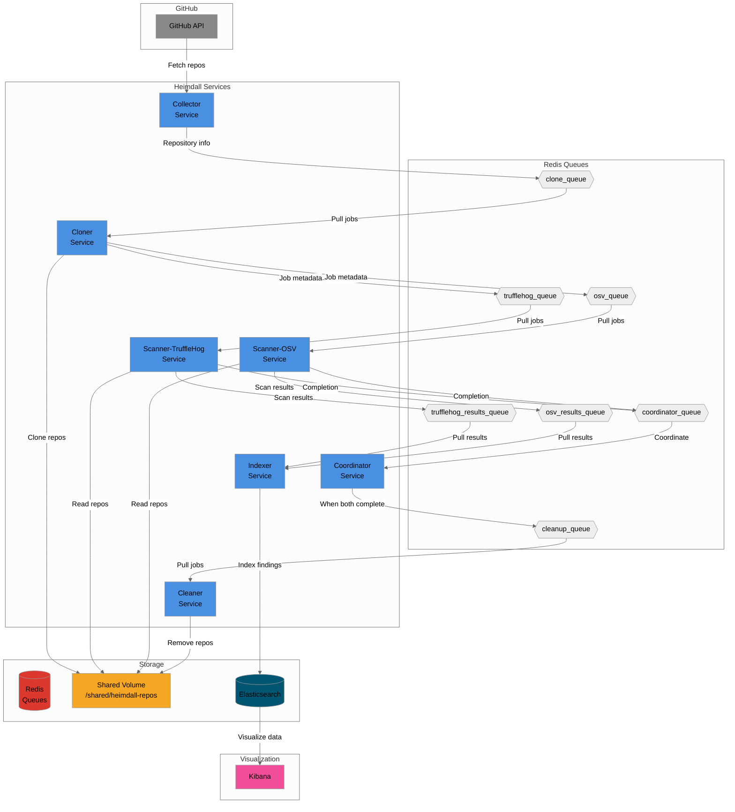

# Heimdall

A security analysis pipeline for GitHub repositories that scans for secrets and dependencies vulnerabilities.

## Architecture



## Quick Start

### Prerequisites

- Docker and Docker Compose
- GitHub token (optional for public repos)
- Redis and Elasticsearch (external deps or from Docker)

### Launch

```bash
# Set required environment variables
export GITHUB_ORG=your-org-name
export GITHUB_TOKEN=your-github-token  # Optional for public repos

# Start all services
docker-compose up -d

# View logs
docker-compose logs -f

# Stop services
docker-compose down
```

### Local Development

```bash
# Start Redis and Elasticsearch
docker run -d -p 6379:6379 redis:alpine
docker run -d -p 9200:9200 -e "discovery.type=single-node" elasticsearch:8.11.0

# Build and run services
make build-all
make run-collector  # In separate terminals
make run-cloner
make run-scanner-trufflehog
make run-scanner-osv
make run-coordinator
make run-cleaner
make run-indexer
```

### Configuration

Services are configured via environment variables. Key settings:
- `GITHUB_ORG`: Organization to scan
- `GITHUB_TOKEN`: Access token for private repos
- `REDIS_URL`: Redis connection (default: localhost:6379)
- `ELASTICSEARCH_URL`: Elasticsearch connection (default: http://localhost:9200)
- `MAX_CONCURRENT_*`: Worker pool sizes
- `SHARED_VOLUME_PATH`: Repository storage location

See `docker-compose.yml` for all available options.
