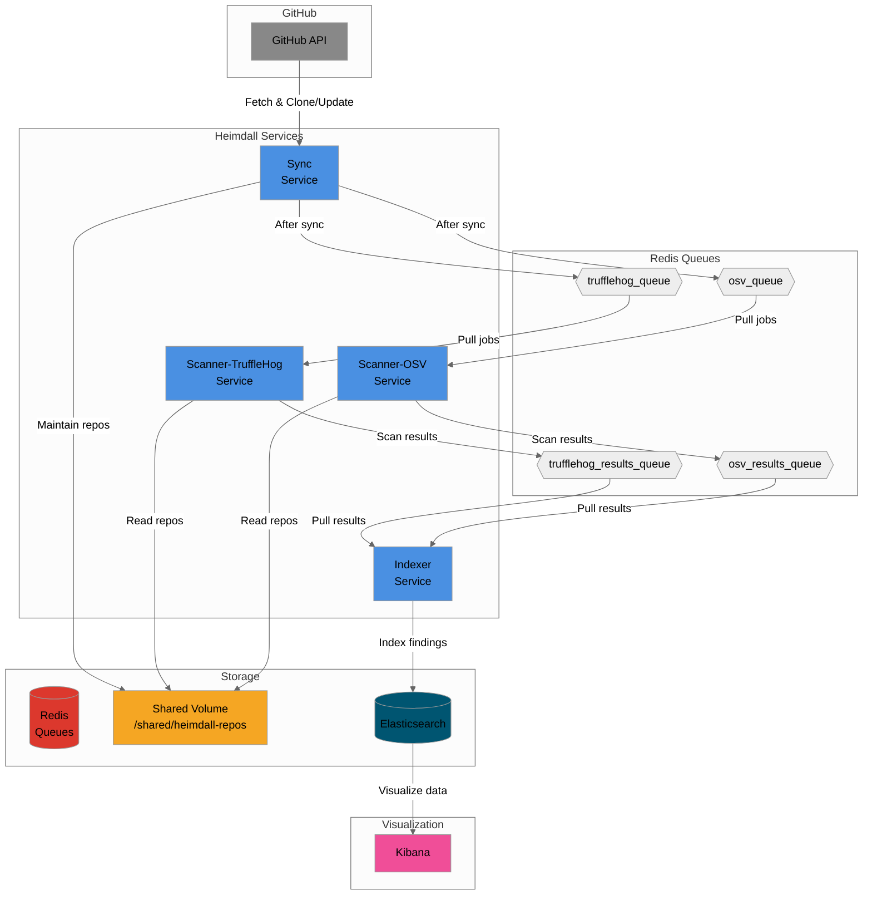

# Heimdall

A security analysis pipeline for GitHub repositories that scans for secrets and vulnerabilities using a simplified microservices architecture.

## Overview

Heimdall consists of four main microservices:
- **Sync**: Maintains a full mirror of the GitHub organization on shared volume
- **Scanner-TruffleHog**: Performs deep secret scanning using TruffleHog with validation
- **Scanner-OSV**: Scans for known vulnerabilities using Google's OSV database
- **Indexer**: Indexes findings into Elasticsearch for visualization

## Architecture



### Prerequisites

- Docker and Docker Compose
- GitHub token (optional for public repos)

### Launch

```bash
# Set required environment variables
export GITHUB_ORG=your-org-name
export GITHUB_TOKEN=your-github-token  # Optional for public repos

# Start all services with dependencies
docker-compose up -d

# View logs for specific services
docker-compose logs -f sync
docker-compose logs -f scanner-trufflehog
docker-compose logs -f scanner-osv
docker-compose logs -f indexer

# Access Kibana dashboards (after startup)
open http://localhost:5601

# Stop all services
docker-compose down
```

### Local Development

```bash
# Start Redis (required for all services)
docker run -d -p 6379:6379 redis:alpine

# Start Elasticsearch (required for Indexer)
docker run -d -p 9200:9200 -e "discovery.type=single-node" elasticsearch:8.11.0

# Build all services
make build-all

# Run services (each in separate terminal)
make run-sync                # Synchronizes GitHub repos
make run-scanner-trufflehog  # Scans for secrets
make run-scanner-osv         # Scans for vulnerabilities
make run-indexer             # Indexes results to Elasticsearch

# Optional: Monitor queues and disk space
make run-monitor
```

### Configuration

Services are configured via environment variables. Key settings:

#### Core Settings
- `GITHUB_ORG`: Organization to scan
- `GITHUB_TOKEN`: Access token for private repos (required for private repos)
- `REDIS_URL`: Redis connection (default: `localhost:6379`)
- `ELASTICSEARCH_URL`: Elasticsearch connection (default: `http://localhost:9200`)
- `SHARED_VOLUME_PATH`: Repository storage location (default: `/shared/heimdall-repos`)

#### Sync Service
- `SYNC_SCHEDULE`: Cron schedule for synchronization (default: `0 */6 * * *` - every 6 hours)
- `MAX_CONCURRENT_SYNCS`: Parallel sync operations (default: 3)
- `SYNC_TIMEOUT_MINUTES`: Timeout per repository (default: 30)
- `GITHUB_API_DELAY_MS`: Delay between API calls for rate limiting (default: 0)

#### Scanner Services
- `MAX_CONCURRENT_SCANS`: Parallel scan operations (default: 3)
- `SCAN_TIMEOUT_MINUTES`: Timeout per scan (default: 30)
- `TRUFFLEHOG_CONCURRENCY`: TruffleHog internal concurrency (default: 8)
- `TRUFFLEHOG_ONLY_VERIFIED`: Only report verified secrets (default: false)

#### Indexer Service
- `MAX_CONCURRENT_WORKERS`: Parallel indexing operations (default: 2)
- `BULK_SIZE`: Elasticsearch bulk operation size (default: 50)
- `BULK_FLUSH_INTERVAL`: Bulk flush interval (default: 10s)

See `docker-compose.yml` for all available options.

## Development

### Building

```bash
# Build all services
make build-all

# Build specific service
make build-sync
make build-scanner-trufflehog
make build-scanner-osv
make build-indexer

# Build Docker images
make docker-build        # all images
make docker-build-sync
make docker-build-scanner-trufflehog
make docker-build-scanner-osv
make docker-build-indexer
```

### Testing

```bash
# Run unit tests
make test

# Run unit tests with coverage
make test-coverage

# Run integration tests (requires Redis)
make test-integration

# Run all tests
make test-all
```

### Monitoring

The monitor tool helps debug queue issues and track disk usage:

```bash
# Run the monitor
make run-monitor

# Or directly
go run ./cmd/monitor
```

This will display:
- Queue lengths and contents
- Disk usage for the shared volume
- Recent activity

## Deployment

Heimdall uses GitHub Actions for CI/CD:
- Pull requests trigger unit tests
- Version tags (`v*`) trigger multi-platform Docker builds
- Images are pushed to GitHub Container Registry (`ghcr.io/klimeurt`)

### Production Considerations

1. **Storage**: Ensure adequate disk space for repository storage (depends on org size)
2. **Memory**: Scanner services can be memory-intensive for large repositories
3. **API Limits**: Configure `GITHUB_API_DELAY_MS` to avoid rate limiting
4. **Security**: Always use GitHub tokens for private repositories
5. **Persistence**: Mount the shared volume to persistent storage in production

## Troubleshooting

### Common Issues

1. **Sync not finding repositories**
   - Check `GITHUB_TOKEN` has appropriate permissions
   - Verify `GITHUB_ORG` is correct
   - Check logs: `docker-compose logs sync`

2. **Scanners not processing**
   - Ensure Sync has completed at least one cycle
   - Check Redis queues using the monitor tool
   - Verify shared volume permissions

3. **No results in Kibana**
   - Wait for full pipeline completion (can take time for large orgs)
   - Check Indexer logs for errors
   - Verify Elasticsearch is accessible

4. **High memory usage**
   - Reduce `MAX_CONCURRENT_*` settings
   - Lower `TRUFFLEHOG_CONCURRENCY`
   - Process smaller batches
