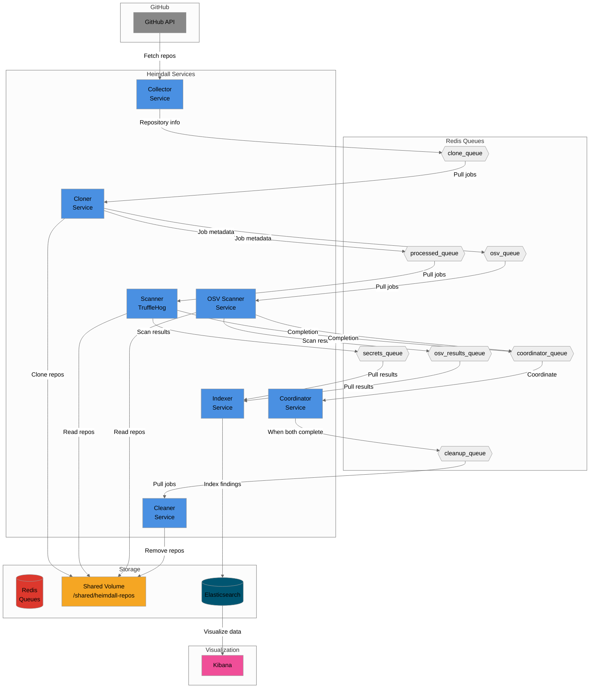

# Heimdall

A security analysis pipeline for GitHub repositories that scans for secrets and sensitive information.

## Architecture

Seven microservices communicating through Redis queues:
- **Collector**: Fetches repositories from GitHub organizations
- **Cloner**: Clones repositories and performs initial analysis
- **Scanner**: Deep secret scanning using TruffleHog
- **OSV Scanner**: Vulnerability scanning for open source dependencies
- **Coordinator**: Coordinates completion of multiple scanners before cleanup
- **Cleaner**: Removes cloned repositories after all scanning completes
- **Indexer**: Indexes scan results to Elasticsearch for search and analysis



### Data Flow

1. **Collector** periodically fetches repository lists from GitHub organizations
2. **Cloner** pulls from `clone_queue`, clones repositories to shared volume, sends to both scanner queues
3. **Scanner (TruffleHog)** pulls from `processed_queue`, scans for secrets, sends results to `secrets_queue`
4. **OSV Scanner** pulls from `osv_queue`, scans for vulnerabilities, sends results to `osv_results_queue`
5. **Both Scanners** send completion messages to `coordinator_queue`
6. **Coordinator** waits for both scanners to complete, then sends to `cleanup_queue`
7. **Indexer** pulls from both `secrets_queue` and `osv_results_queue`, indexes findings to Elasticsearch
8. **Cleaner** pulls from `cleanup_queue`, removes cloned repositories

## Quick Start

### Prerequisites
- Docker and Docker Compose
- GitHub token (optional for public repos)
- Elasticsearch (for indexer service)

### Launch

```bash
# Set required environment variables
export GITHUB_ORG=your-org-name
export GITHUB_TOKEN=your-github-token  # Optional for public repos

# Start all services
docker-compose up -d

# View logs
docker-compose logs -f

# Stop services
docker-compose down
```

### Local Development

```bash
# Start Redis and Elasticsearch
docker run -d -p 6379:6379 redis:alpine
docker run -d -p 9200:9200 -e "discovery.type=single-node" elasticsearch:8.11.0

# Build and run services
make build-all
make run-collector  # In separate terminals
make run-cloner
make run-scanner
make run-osv-scanner
make run-coordinator
make run-cleaner
make run-indexer
```

### Configuration

Services are configured via environment variables. Key settings:
- `GITHUB_ORG`: Organization to scan
- `GITHUB_TOKEN`: Access token for private repos
- `REDIS_URL`: Redis connection (default: localhost:6379)
- `ELASTICSEARCH_URL`: Elasticsearch connection (default: http://localhost:9200)
- `MAX_CONCURRENT_*`: Worker pool sizes
- `SHARED_VOLUME_PATH`: Repository storage location

See `docker-compose.yml` for all available options.